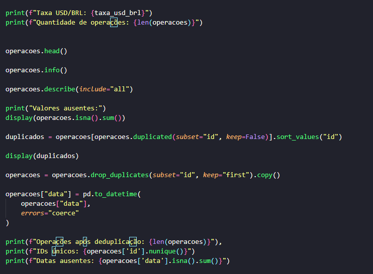
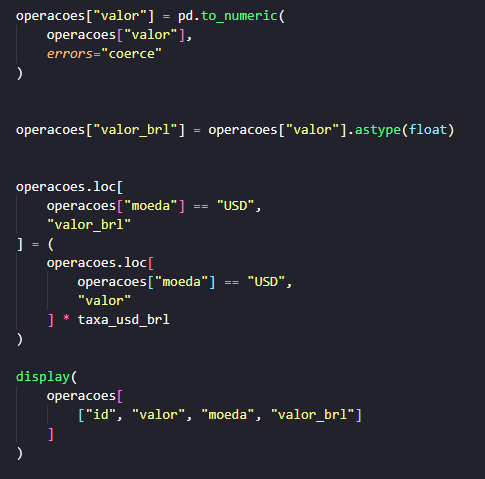
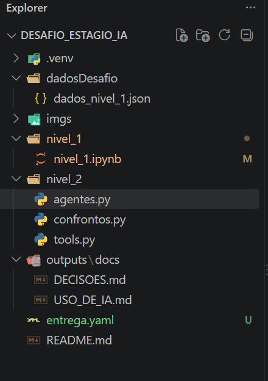

# Desafio de Estágio em IA

Projeto desenvolvido para o desafio de estágio em Inteligência Artificial, com foco na análise de operações financeiras, identificação de sinais de risco e utilização de Inteligência Artificial para geração de parecer estruturado.

---

## 1. Objetivo do projeto

O objetivo do projeto é desenvolver uma solução capaz de:

- carregar e analisar dados financeiros;

- realizar tratamento e limpeza dos dados;

- normalizar valores monetários;

- aplicar regras determinísticas para identificação de comportamentos atípicos;
- identificar clientes sinalizados pelas regras;
- utilizar um modelo de linguagem para interpretar os sinais encontrados;
- gerar um parecer estruturado;
- validar a resposta produzida pela Inteligência Artificial;
- medir a latência da execução;
- comparar diferentes estratégias de prompt.

A solução foi desenvolvida buscando manter uma separação clara entre:

1. **cálculos determinísticos**, realizados pelo código;
2. **interpretação textual**, realizada pelo modelo de linguagem.

---

# 2. Tecnologias utilizadas

O projeto utiliza as seguintes tecnologias:

- **Python** — linguagem principal;
- **Jupyter Notebook** — ambiente utilizado para desenvolvimento e documentação da análise;
- **Pandas** — manipulação, limpeza e análise dos dados;
- **JSON** — formato dos dados de entrada;
- **Pydantic** — validação e estruturação das respostas da IA;
- **Ollama** — execução local do modelo de linguagem;
- **Qwen3** — modelo de linguagem utilizado localmente;
- **Git** — controle de versão;
- **GitHub** — armazenamento e apresentação do projeto.

---

# 3. Estrutura do projeto

